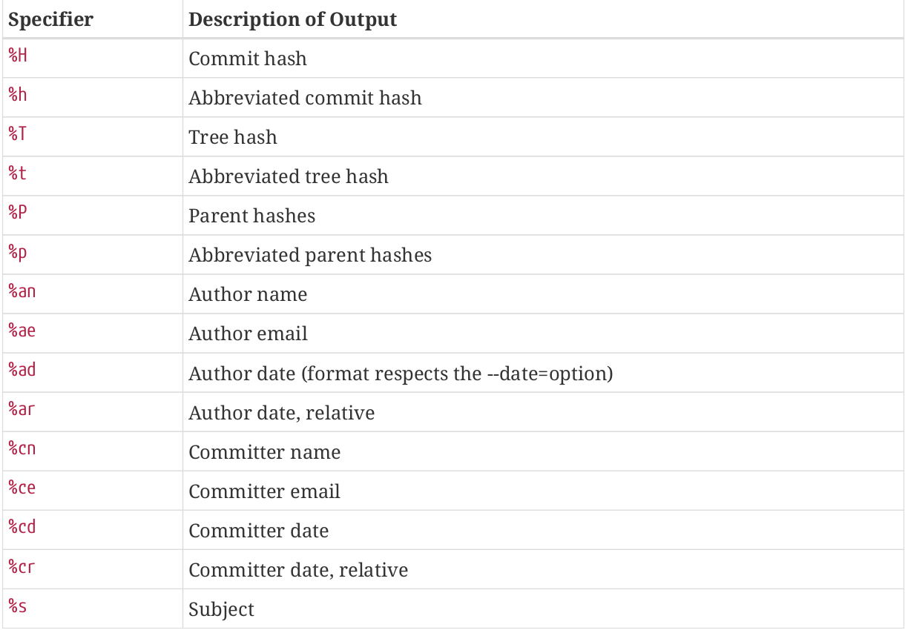

# Log Command

* Get recent commit
```shell
git log
```

* Get [diff](diff) history of commit, you can also limit the output by the number
```shell
git log -p -2

git log --patch -2
```

* See how many line was added or removed
```shell
git log --stat
```


* Short the output (oneline, short, full, fuller, format)
```shell
git log --pretty=oneline
```

* Format output
```shell
git log --pretty=format: "%h - %an, %ar : %s"
```


